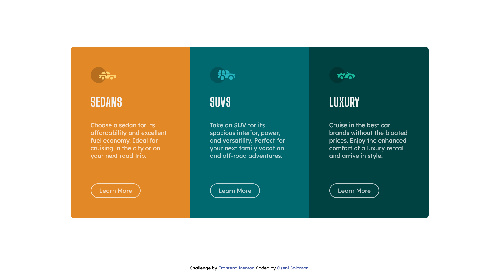

# Frontend Mentor - 3-column preview card component solution

This is a solution to the [3-column preview card component challenge on Frontend Mentor](https://www.frontendmentor.io/challenges/3column-preview-card-component-pH92eAR2-). Frontend Mentor challenges help you improve your coding skills by building realistic projects.

## Table of contents

- [Overview](#overview)
  - [The challenge](#the-challenge)
  - [Screenshot](#screenshot)
  - [Links](#links)
- [My process](#my-process)
  - [Built with](#built-with)
  - [What I learned](#what-i-learned)
  - [Useful resources](#useful-resources)
- [Author](#author)

**Note: Delete this note and update the table of contents based on what sections you keep.**

## Overview

### The challenge

Users should be able to:

- View the optimal layout depending on their device's screen size
- See hover states for interactive elements

### Screenshot



### Links

- Solution URL: [GitHub repository](https://github.com/SoloLere/card-component.git)
- Live Site URL: [Live site](https://sololere.github.io/card-component/)

## My process

### Built with

- Semantic HTML5 markup
- SASS
- CSS custom properties
- Grid

### What I learned

- When an image is a flex item, Flexbox has an odd default behavior wher images get stretched horizontally to fill the the width of parent container. Stop this by doing

```css
img {
  align-self: start;
}
```
A cool animation effects for botton that renders the text transparent can be achieved by using **Mix-blend-mode**

```scss
&:hover {
  background-color: #fff;
  color: #000;
  mix-blend-mode: screen;
  transform: translateY(-0.3rem);
  box-shadow: 0 1rem 2rem rgba(#000, 0.2);
}
```


### Useful resources

- [Example resource 1](https://www.youtube.com/watch?v=FFf7wnA5MqQ) - This helped me for learn how mix-blend-mode can be used to achive various animation effects.


## Author

- Mail - [Oseni Solomon](jnrolalere@gmail.com)
- Frontend Mentor - [@myusername](https://www.frontendmentor.io/profile/@SoloLere)
